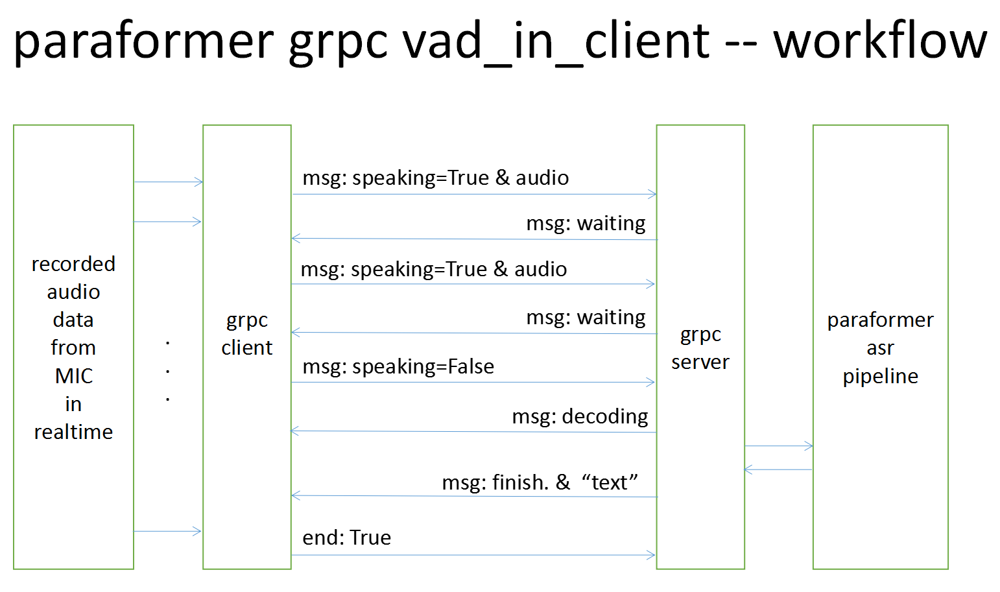

# Using paraformer with grpc
We can send streaming audio data to server in real-time with grpc client every 10 ms e.g., and get transcribed text when stop speaking.
The audio data is in streaming, the asr inference process is in offline.


## Steps

Step 1) Optional, prepare server environment (on server).  Install modelscope and funasr with pip or with cuda-docker image.

Option 1: Install modelscope and funasr with [pip](https://github.com/alibaba-damo-academy/FunASR#installation)

Option 2: or install with cuda-docker image as: 

```
CID=`docker run --network host -d -it --gpus '"device=0"' registry.cn-hangzhou.aliyuncs.com/modelscope-repo/modelscope:ubuntu20.04-cuda11.3.0-py37-torch1.11.0-tf1.15.5-1.2.0`
echo $CID
docker exec -it $CID /bin/bash
```
Get funasr source code and get into grpc directory.
```
git clone https://github.com/alibaba-damo-academy/FunASR
cd FunASR/funasr/runtime/python/grpc/
```


Step 2) Optional, generate protobuf file (run on server, the two generated pb file are both used for server and client).
```
# paraformer_pb2.py and paraformer_pb2_grpc.py are already generated.
python -m grpc_tools.protoc  --proto_path=./proto -I ./proto    --python_out=. --grpc_python_out=./ ./proto/paraformer.proto
```

Step 3) Start grpc server (on server).
```
python grpc_main_server.py --port 10095
```

Step 4) Start grpc client (on client with microphone).
```
# Optional, Install dependency.
python -m pip install pyaudio webrtcvad
```
```
# Start client.
python grpc_main_client_mic.py --host 127.0.0.1 --port 10095
```


## Workflow in desgin



## Reference
We borrow from or refer to some code as:

1)https://github.com/wenet-e2e/wenet/tree/main/runtime/core/grpc

2)https://github.com/Open-Speech-EkStep/inference_service/blob/main/realtime_inference_service.py